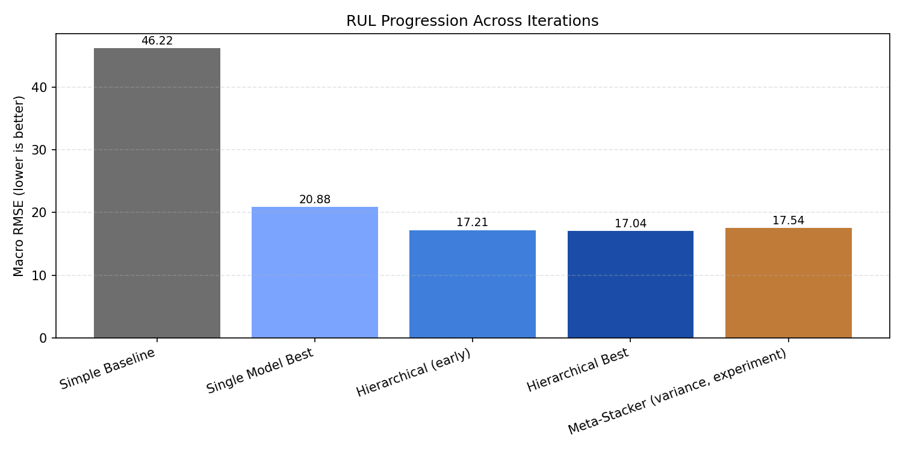
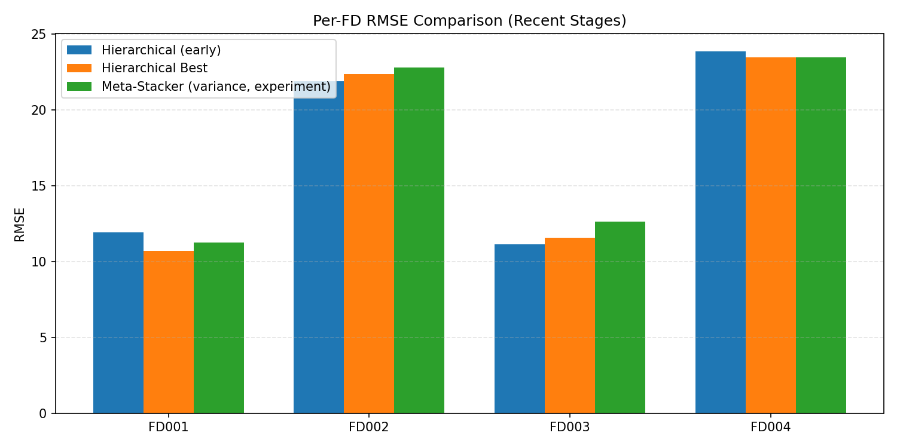
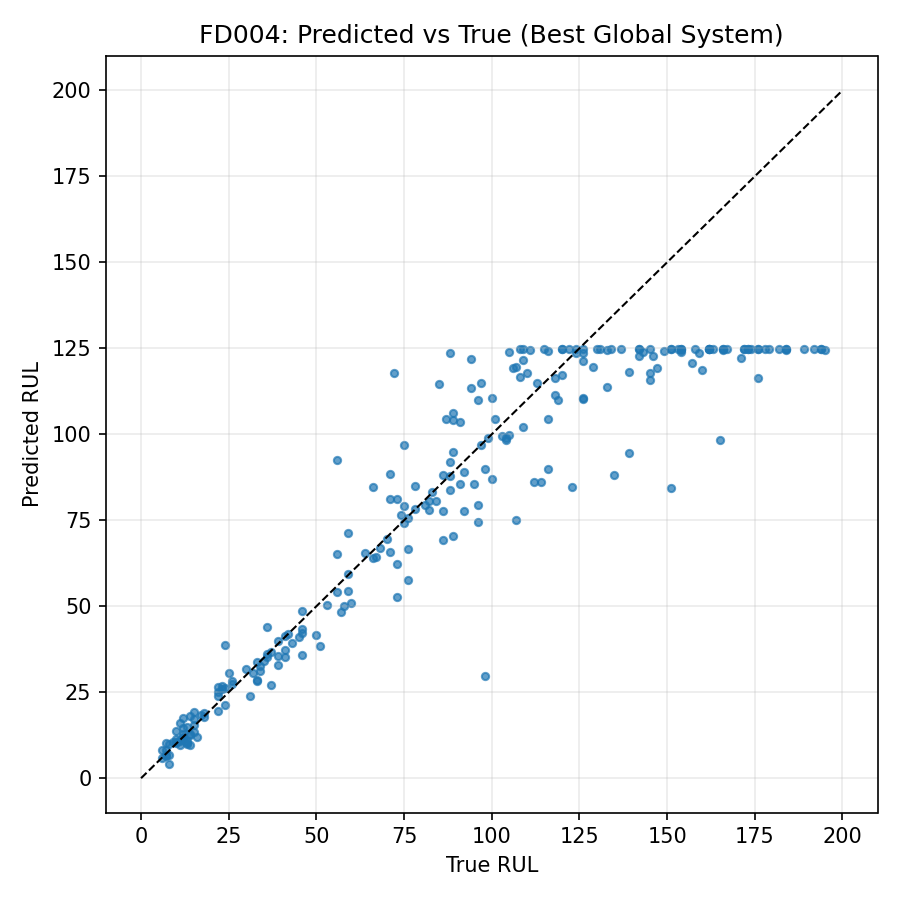
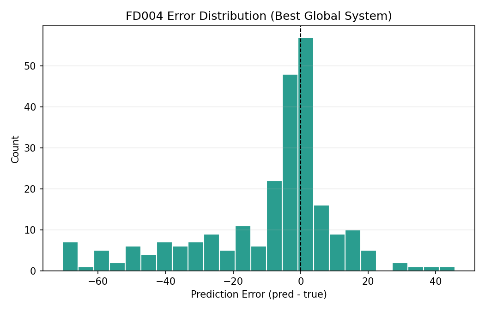
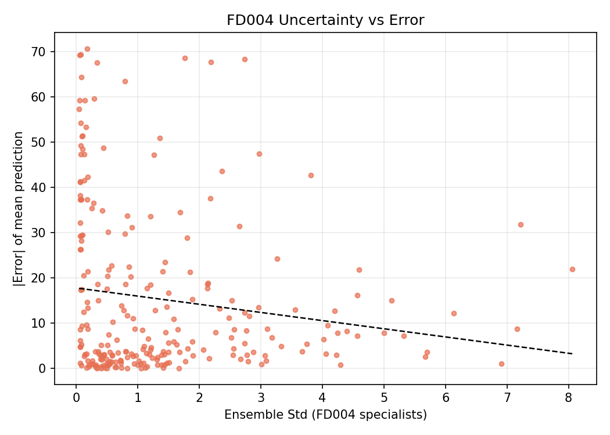
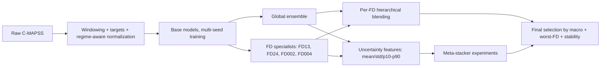

# Hierarchical Ensemble & Uncertainty-Aware RUL Prediction
NASA C-MAPSS turbofan engines (`FD001`-`FD004`)

**Macro RMSE: `17.04` | `-63.1%` vs baseline (`46.22`)**


This repository documents a full RUL engineering pipeline: from a weak baseline to a stable multi-model system, with explicit handling of domain shift and uncertainty.

## TL;DR
- Full multi-condition C-MAPSS setup (`FD001..FD004`), not a single-subset demo.
- Progression from `46.22` to `17.04` macro RMSE (`-63.1%`).
- Hierarchical system: global ensemble + FD specialists + per-FD blending.
- Uncertainty-aware meta-stacking was implemented and tested (did not beat current best, but produced useful diagnostics).
- Project is currently paused on a performance plateau (`~17 macro`) after multiple hard loops.

## Key Results (Hard Numbers)
| Model / Stage | Macro RMSE | FD001 | FD002 | FD003 | FD004 | Worst FD RMSE | Delta vs baseline |
|---|---:|---:|---:|---:|---:|---:|---:|
| Simple baseline | 46.22 | 38.46 | 54.10 | 39.18 | 53.12 | 54.10 | - |
| Single model best | 20.88 | 12.38 | 28.61 | 12.27 | 30.28 | 30.28 | -54.8% |
| Hierarchical (early) | 17.21 | 11.93 | 21.91 | 11.15 | 23.87 | 23.87 | -62.8% |
| **Hierarchical best (current)** | **17.04** | **10.72** | **22.39** | **11.60** | **23.47** | **23.47** | **-63.1%** |
| Meta-stacker (XGBoost + variance, experiment) | 17.54 | 11.26 | 22.81 | 12.63 | 23.48 | 23.48 | -62.0% |

Source tables:
- `docs/tables/summary_results.csv`
- `docs/tables/best_per_fd.csv`

## Visual Summary
### 1) Progression across major iterations


### 2) Per-FD comparison (recent stages)


### 3) FD004 behavior (hardest subset)



### 4) Uncertainty signal vs error (FD004)


## Problem & Dataset
- Dataset: NASA C-MAPSS turbofan degradation trajectories.
- 4 subsets (`FD001..FD004`) with increasing operational complexity and fault-mode shift.
- Task: estimate Remaining Useful Life (RUL, cycles to failure).
- Why this is hard:
  - strong regime/domain shift (`FD002` and `FD004`),
  - sequence length / degradation heterogeneity,
  - tail safety errors (late warnings) matter more than average error.

## Approach / Pipeline


## What Drove the Gains
- Biggest lift came from **system-level design**, not one architecture swap:
  - data/feature methodology fixes,
  - specialist models for shifted domains,
  - stability-aware model selection,
  - per-FD blending.
- Additional loops improved robustness, but showed **diminishing returns** near `~17 macro`.

## Lessons Learned (Production Mindset)
- Tail behavior and worst-FD metrics are essential; macro RMSE alone is not enough.
- FD004-only validation can look great, but full-system transfer can still underperform.
- Ensemble variance is a useful risk signal, even when a meta-learner does not improve aggregate RMSE.
- Past a certain point, adding complexity can raise variance instead of lowering test error.

## What Could Still Improve the Score (Theoretical, Small-to-Moderate Gain)
Given current plateau, these are the most realistic next moves:
1. Stronger FD002 specialist loop (symmetry with FD004 playbook, longer context + stronger tail/late weighting).
2. Deeper ensemble curation with stricter anti-leakage test-like selection folds.
3. Nonlinear per-FD stackers with stronger regularization and explicit fallback policies.
4. Better regime segmentation upstream (before model training), then specialist routing.

These were intentionally not pushed indefinitely due to expected marginal gain vs engineering time.

## Repro (Current Best)
```bash
pip install -r requirements.txt

python scripts/hierarchical_ensemble_multifd.py \
  --global-model-dirs "models/seed_ensemble_global_trial003_loop2/trial_003_seed42,models/seed_ensemble_global_trial003_loop2/trial_003_seed43,models/seed_ensemble_global_trial003_loop2/trial_003_seed44,models/seed_ensemble_global_trial003_loop2/trial_003_seed45,models/seed_ensemble_global_trial003_loop2/trial_003_seed46" \
  --fd13-model-dir models/tuning_fd13_stage_allpoints_multiseed_loop1/trial_001/seed_42 \
  --fd24-model-dir models/tuning_fd24_stage_allpoints_multiseed_v3_fullrerun/trial_002/seed_43 \
  --fds FD001,FD002,FD003,FD004 \
  --weight-grid-size 101 \
  --output-dir outputs/hierarchical_ensemble_cross_ensglobal_newfd13_fd24v3full_t2s43_w101 \
  --device cuda
```

## Repo Layout
- `src/` core pipeline modules
- `scripts/` training/tuning/ensemble/meta-stacking utilities
- `config/` experiment configs
- `docs/figures/` README visualizations
- `docs/tables/` metric tables used in README
- `docs/WORKLOG.md` chronological engineering log

## Tech Stack
- PyTorch
- XGBoost
- scikit-learn
- pandas / NumPy
- matplotlib

## Status
- Interim target `<25`: achieved.
- Stretch target `<=12.5`: not achieved.
- Project paused at plateau after extensive loops; left in reproducible state.
